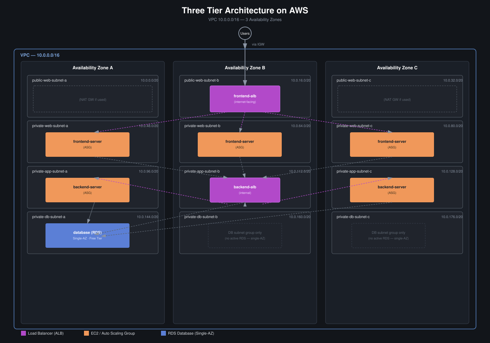
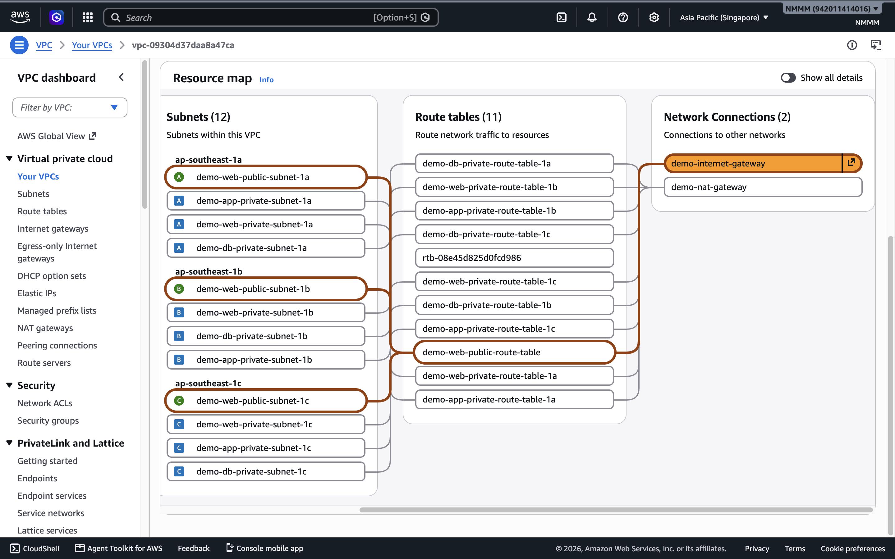
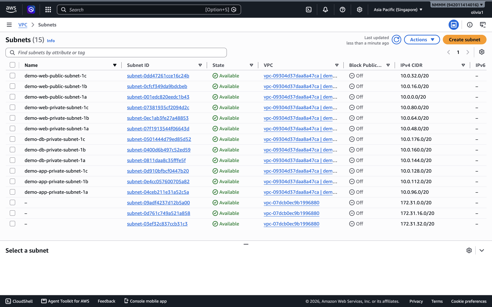
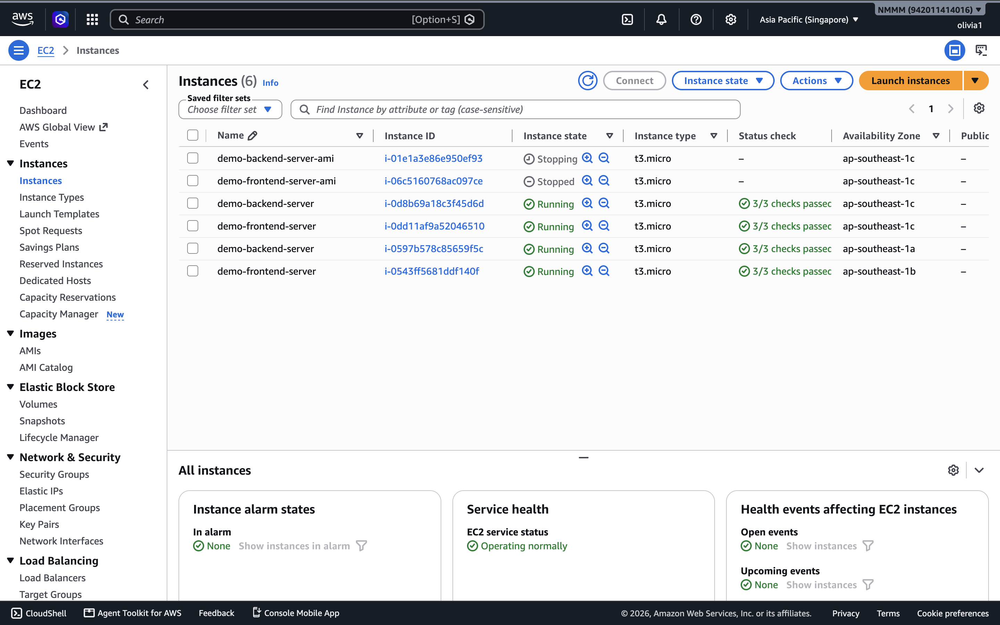
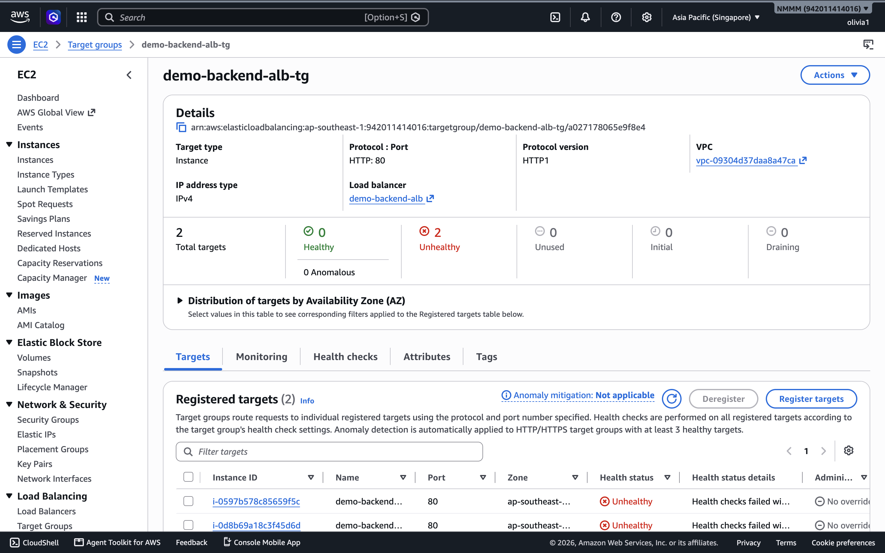
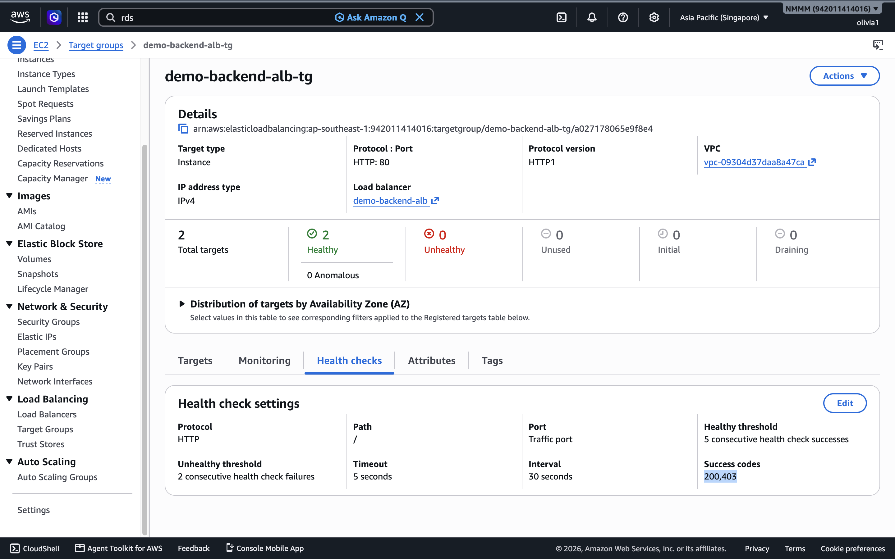
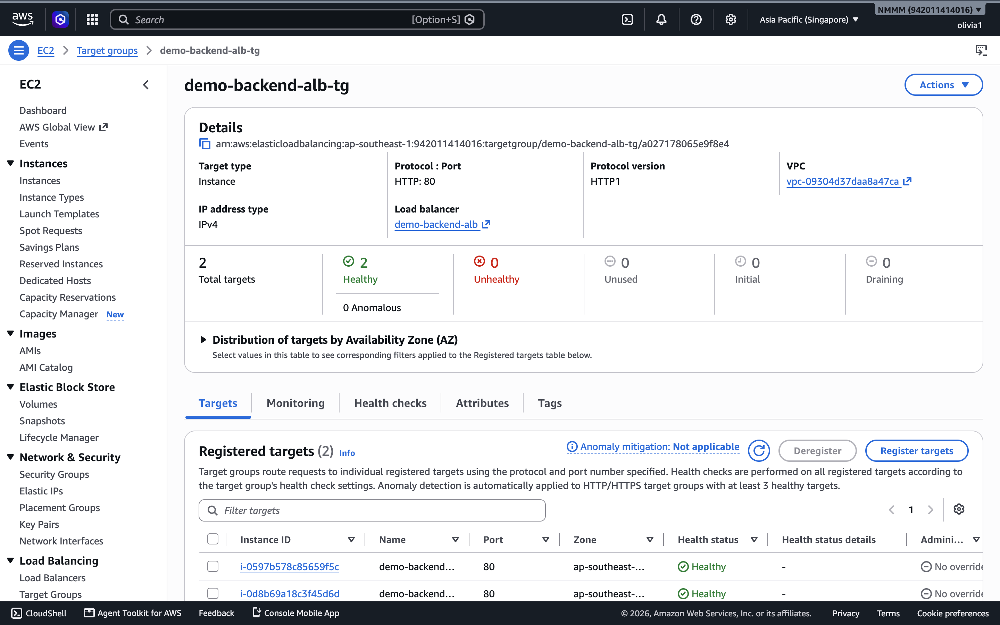

# aws-three-tier-architecture-manual
AWS-three-tier-architecture with ASG, ALB, and RDS
# AWS Three-Tier Architecture Deployment

## Project Overview

This project demonstrates the design and deployment of a three-tier web application architecture on Amazon Web Services (AWS).

The goal of this project was to build a secure and scalable architecture by separating the application into three layers:

1. Frontend Layer
2. Application Layer
3. Database Layer

The architecture uses public and private subnets, Application Load Balancers, EC2 instances, Auto Scaling Groups, and Amazon RDS.



---

# Architecture

```
                    Internet
                       |
                       |
              Frontend Application
                       |
              Public Application Load Balancer
                       |
                       |
              Frontend EC2 Instances
              (Nginx + Git)
                       |
                       |
        --------------------------------
                       |
              Internal Backend ALB
                       |
                       |
              Backend EC2 Instances
              (Apache + PHP)
                       |
                       |
                  Amazon RDS
                  MySQL Database
```

**VPC:** `10.0.0.0/16` across 3 Availability Zones (A, B, C), with 12 subnets across 4 tiers.

---
# Console Evidence

Screenshots from the AWS Console showing the deployed resources.

**VPC Resource Map**


**Subnets Overview**


**EC2 Instances (Frontend + Backend, healthy across AZs)**


**Auto Scaling Groups**


**Application Load Balancers**


# AWS Services Used

## Networking

* Amazon VPC
* Public and Private Subnets
* Availability Zones
* Internet Gateway
* NAT Gateway
* Route Tables
* Security Groups

## Compute

* Amazon EC2
* Amazon Machine Images (AMI)
* Launch Templates
* Auto Scaling Groups

## Load Balancing

* Application Load Balancer (ALB)
* Target Groups
* Health Checks

## Database

* Amazon RDS MySQL
* Database Subnet Group

---

# Architecture Design

## Frontend Layer

The frontend layer is responsible for handling user requests.

Components:

* Public Application Load Balancer
* Frontend EC2 instances
* Nginx web server

The frontend ALB receives traffic from users and distributes requests to frontend EC2 instances.

---

## Application Layer

The application layer processes backend requests.

Components:

* Internal Application Load Balancer
* Backend EC2 instances
* Apache HTTP Server
* PHP

The backend ALB is internal because the application layer does not need direct public internet access.

Only the frontend layer communicates with the backend layer.

---

## Database Layer

The database layer stores application data.

Components:

* Amazon RDS MySQL
* Private database subnet group

The database is placed in private subnets and is not publicly accessible. Deployed as **Single-AZ** to stay within AWS Free Tier (Multi-AZ RDS is not free-tier eligible).

---

# Security Design

Security groups were configured to control communication between different layers.

Traffic flow:

```
Internet
   |
   ↓
Frontend ALB
   |
   ↓
Frontend EC2

Frontend EC2
   |
   ↓
Backend Internal ALB

Backend ALB
   |
   ↓
Backend EC2

Backend EC2
   |
   ↓
RDS MySQL
```

Each layer only allows required traffic from the previous layer.

---

# Subnet CIDR Reference

| Tier              | AZ-A            | AZ-B             | AZ-C             |
|-------------------|------------------|------------------|------------------|
| Public Web        | 10.0.0.0/20      | 10.0.16.0/20     | 10.0.32.0/20     |
| Private Web       | 10.0.48.0/20     | 10.0.64.0/20     | 10.0.80.0/20     |
| Private App       | 10.0.96.0/20     | 10.0.112.0/20    | 10.0.128.0/20    |
| Private DB        | 10.0.144.0/20    | 10.0.160.0/20    | 10.0.176.0/20    |


---

# Implementation Steps

## 1. Create Networking Infrastructure

* Created VPC
* Created public and private subnets
* Configured route tables
* Attached Internet Gateway
* Configured NAT Gateway

---

## 2. Configure Frontend Servers

Installed:

* Nginx
* Git

Configured Nginx as the frontend web server and reverse proxy.

---

## 3. Configure Backend Servers

Installed:

* Apache HTTP Server
* PHP
* MySQL client
* Git

Configured backend EC2 instances to communicate with the database layer.

---

## 4. Configure Load Balancers

Created:

* Frontend public ALB
* Backend internal ALB

Configured target groups and health checks.

---

## 5. Configure Auto Scaling

Created:

* AMIs
* Launch Templates
* Auto Scaling Groups

This allows EC2 instances to be created automatically based on the defined configuration.

---

# Troubleshooting Experience

During this project, I encountered and solved several real deployment issues.

## Nginx Configuration Issue

Problem:

Nginx failed to start because of configuration syntax errors.

Solution:

* Checked Nginx configuration using:

```
sudo nginx -t
```

* Corrected configuration issues.

---

## Backend ALB Health Check Failure

Problem:

Backend target group showed:

```
Health checks failed with codes: [403]
```



Root Cause:

The target group's health check "Success codes" setting only accepted HTTP 200, but the backend server was returning 403 for the health check path.

Solution:

* Verified Apache service was running and the backend was reachable locally.
* Updated the target group's health check "Success codes" to include 403, which resolved the health check failures.





> Note: this was a practical fix for the lab environment. In a production setup, I would investigate *why* the app returns 403 (e.g. file permissions, `.htaccess` rules, or missing index file) rather than just accepting 403 as a healthy response.

---

## Newly Launched Targets Showing Unhealthy

Problem:

After launching new EC2 instances into the target group, they immediately showed as unhealthy.

Solution:

* Learned that newly registered targets go through an "initial" state and need a few health check cycles (~1-2 minutes) to pass before showing healthy.
* In parallel, verified security group rules allowed inbound traffic from the ALB's security group on the health check port.

---

## Learning About Launch Template User Data

Problem:

Frontend Nginx configuration contained:

proxy_pass http://update-me;


Solution:

Understood that the placeholder was replaced during EC2 launch using user data:

sed -i 's/update-me/backend-alb-url/g' nginx.conf


This allowed the frontend layer to communicate with the internal backend ALB.

---

# Skills Demonstrated

Through this project, I practiced:

* AWS networking fundamentals
* VPC design
* Subnet architecture
* Security group configuration
* Load balancer configuration
* EC2 deployment
* Auto Scaling
* Linux server administration
* Nginx configuration
* Apache configuration
* Troubleshooting AWS infrastructure issues

---

# Cost Notes

* RDS deployed as **Single-AZ** to stay within AWS Free Tier.
* **Remember to terminate the NAT Gateway, ALBs, ASG instances, and RDS instance** when not actively using this project — NAT Gateway and ALBs incur hourly charges even when idle.

---

# Future Improvements

Planned improvements:

* Rebuild the architecture using Terraform
* Add CI/CD pipeline
* Add monitoring with CloudWatch
* Improve health check endpoints
* Implement HTTPS using ACM certificates
* Improve security using IAM best practices

---

# Reference

This project was created using AWS documentation and online learning resources as references. The architecture was implemented, tested, and troubleshot independently.

Just select all the text above, copy it, and paste it over everything in your GitHub editor at that link, then scroll down and click Commit changes.
Solution:

* Verified Apache service was running and the backend was reachable locally.
* Updated the target group's health check "Success codes" 200 to include 403,
  which resolved the health check failures.
* Note: this was a practical fix for the lab environment. In a production
  setup, I would investigate why the app returns 403 (e.g. file permissions,
  .htaccess rules, or missing index file) rather than just accepting 403 as healthy.

---

## Newly Launched Targets Showing Unhealthy

Problem:

After launching new EC2 instances into the target group, they immediately showed as unhealthy.

Solution:

* Learned that newly registered targets go through an "initial" state and need a few health check cycles (~1-2 minutes) to pass before showing healthy.
* In parallel, verified security group rules allowed inbound traffic from the ALB's security group on the health check port.

---

## Learning About Launch Template User Data

Problem:

Frontend Nginx configuration contained:

```
proxy_pass http://update-me;
```

Solution:

Understood that the placeholder was replaced during EC2 launch using user data:

```
sed -i 's/update-me/backend-alb-url/g' nginx.conf
```

This allowed the frontend layer to communicate with the internal backend ALB.

---

# Skills Demonstrated

Through this project, I practiced:

* AWS networking fundamentals
* VPC design
* Subnet architecture
* Security group configuration
* Load balancer configuration
* EC2 deployment
* Auto Scaling
* Linux server administration
* Nginx configuration
* Apache configuration
* Troubleshooting AWS infrastructure issues

---

# Cost Notes

* RDS deployed as **Single-AZ** to stay within AWS Free Tier.
* **Remember to terminate the NAT Gateway, ALBs, ASG instances, and RDS instance** when not actively using this project — NAT Gateway and ALBs incur hourly charges even when idle.

---

# Future Improvements

Planned improvements:

* Rebuild the architecture using Terraform
* Add CI/CD pipeline
* Add monitoring with CloudWatch
* Improve health check endpoints
* Implement HTTPS using ACM certificates
* Improve security using IAM best practices

---

# Reference

This project was created using AWS documentation and online learning resources as references. The architecture was implemented, tested, and troubleshot independently.
